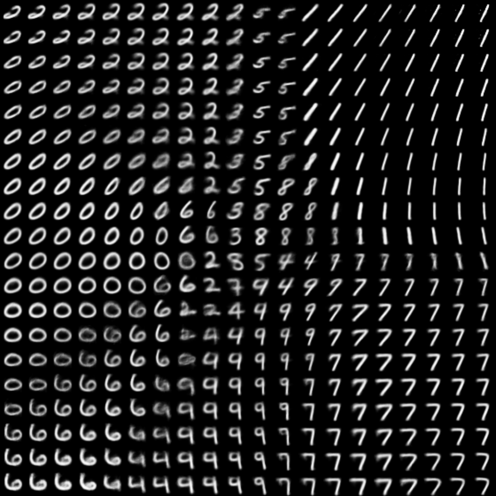
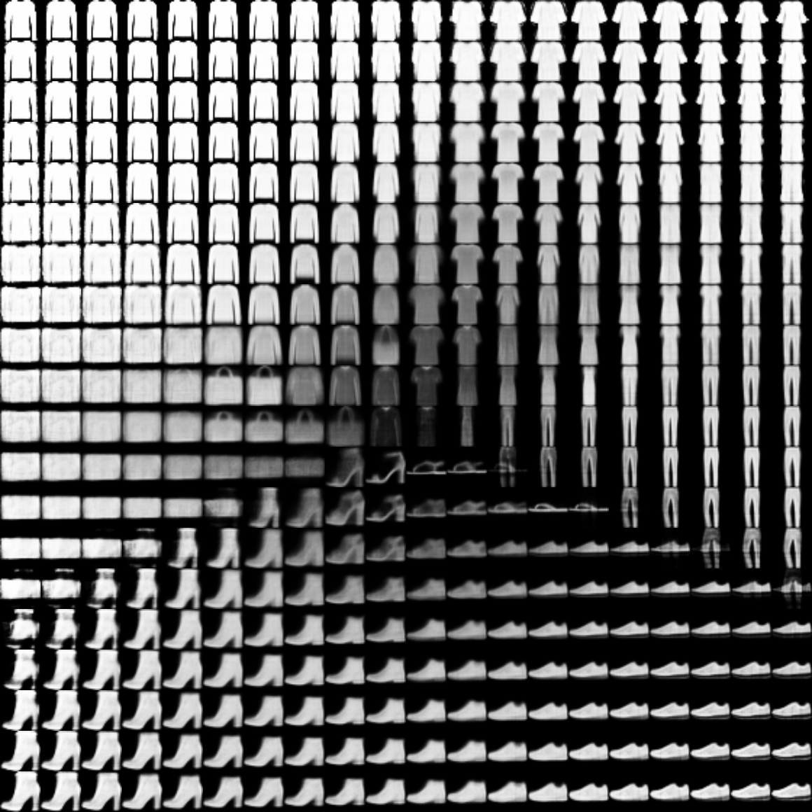

# Variational Autoencoder
An implementation of a variational autoencoder (VAE) see [Kingma and Welling (2013)](https://arxiv.org/abs/1312.6114). Useful resources to understand VAEs:
- [Tutorial - What is a variational autoencoder?](https://jaan.io/what-is-variational-autoencoder-vae-tutorial/) by Jaan Altosaar
- [Variational Autoencoder: Intuition and Implementation](https://wiseodd.github.io/techblog/2016/12/10/variational-autoencoder/) by Augustinus Kristiadi

## Visualizations of the latent space
MNIST, 2 dimensional latent space

Fashion MNIST, 2 dimensional latent space

